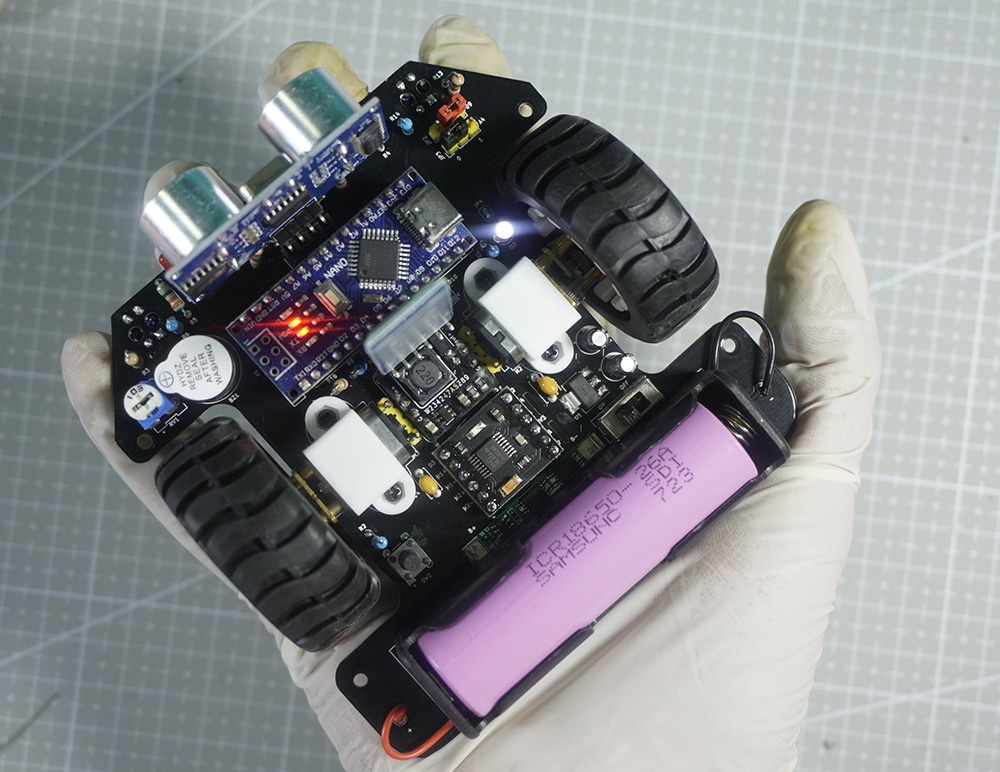

# meroBot

meroBot is a robotics platform based on Arduino. It is a DIY kit which can be assembled and soldered by the maker or student. It can be programmed by scratch [drag and drop programming].

## Specifications

- Based on Arduino Nano
- Programmed via Scratch
- Drag and Drop Programming
- Dimensions:10x10x5 cm
- Mass: 180 grams
- Ultrasonic Sensor to detect objects and obstacles
- IR Sensors to detect line and follow it
- Bluetooth sensor so that it can be controller via Phone.
- Easy to solder and can be assembled by High School Students
- Perfect STEM Kit.